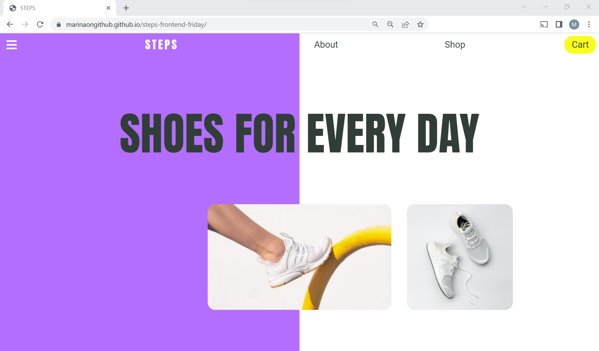
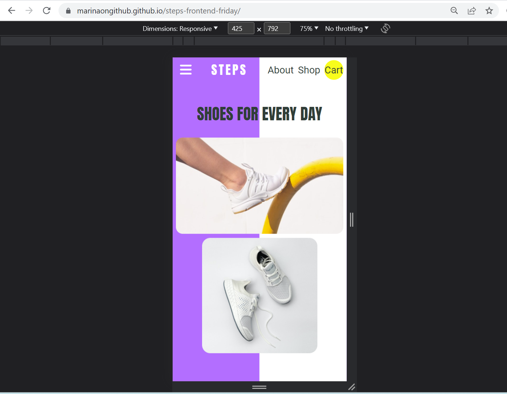

# STEPS Frontend Friday Challenge

This repository contains my solution for the Frontend Friday Challenge organized by Women Who Code. The challenge was to implement the UI for a brand landing page.

## Challenge Description

The challenge required implementing a landing page for a shoes brand "STEPS" based on a Figma file. The challenge did not require a responsive design. The web page header includes a hamburger style icon and the brand name on the right and a navigation menu on the left. The main section includes the brand slogan and below, two images illustrating the brand products.

## Design Specification

Refer to this [Figma file](https://www.figma.com/proto/ZE0BjiJmjxFsCATs6Mkdc1/Untitled?type=design&node-id=1-2&scaling=scale-down&page-id=0%3A1) for the design specifications, including the layout, typography, colors, and any specific design elements required.

## Technologies Used

- HTML5
- CSS3

## Approach

I followed the given design specification and utilized modern HTML and CSS to create the landing page. Here's a brief overview of my approach:

1. Structured the HTML according to the different sections of the landing page.
2. Styled the page using CSS, focusing on layout, typography, colors, and responsive design.

## Features Implemented

- Responsive layout that adapts to different screen sizes (desktop, tablet, and mobile).
- Navigation menu higlighted on hover and cursor changed to pointer.

## Usage

Check the live app [here](https://marinaongithub.github.io/steps-frontend-friday/) or see the screenshots below:

## License 

MIT License
